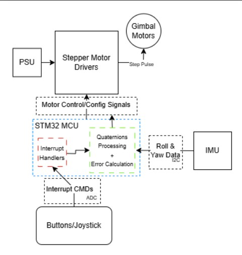
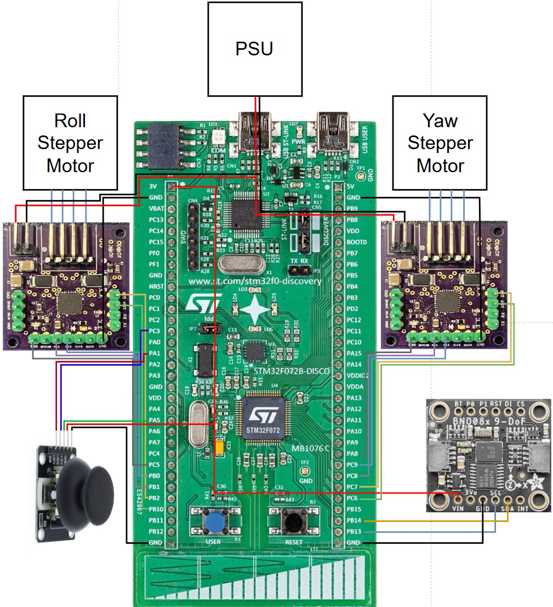

### Team Members
* Miles Bovero
* Lawrence Ponce
* Brian Stites
* Burke Dambly
  
# 2-Axis Gimbal System using BNO085 and TMC2209

This project implements a 2-axis gimbal system powered by NEMA 17 stepper motors, a custom TMC2209 stepper driver, and the BNO085 IMU, all controlled by an STM32F0 microcontroller. The system supports both **manual joystick control** and **automatic gimbal stabilization** using quaternion feedback from the IMU.

## Features

- **Automatic stabilization** using BNO085 quaternion output (Rotation Vector).
- **Manual override mode** via joystick input.
- **Custom driver logic** for TMC2209 stepper controllers (no libraries).
- **Status indication** using onboard LEDs:
  - 🟢 **Green**: System ready
  - 🟡 **Yellow**: Manual mode
  - 🔴 **Red**: Gimbal stabilization mode
 

## Hardware

- **Parts List:** https://docs.google.com/spreadsheets/d/1ASUmAiZSFDpc-IezaZOCM-j6GSmX4DIoBAKoNAnrK8I/edit?gid=0#gid=0
- **BOM:** https://docs.google.com/spreadsheets/d/1F1Fa0VNCSiJDzJphaV6HfyEmqR7Gyjhc7J4WnCEqq48/edit?usp=sharing

## Control Logic

- System starts in **gimbal mode**. The initial orientation is stored as the target.
- A joystick button press toggles between **manual** and **gimbal** mode.
- In **manual mode**, the joystick directly sets direction and speed of the motors.
- In **gimbal mode**, real-time quaternion feedback from the IMU drives motors to minimize roll and yaw error.
- The STM32 blue on-board button acts as a **kill switch**, freezing the system until reset.

## Project Structure

- `main.c` – Main call to control function.
- `bno085.c/h` – IMU I2C interface and quaternion parsing logic.
- `motor_control.c/h` – Low-level motor driver setup and PWM control.
- `quaternion.c/h` – Roll and yaw error computation from quaternion deltas.
- `gimbal_controller.c/h` – Core application logic for managing gimbal behavior, mode switching, LED indicators, and overall control flow between manual and automatic stabilization.
- `joystick.c/h` – ADC interface for reading joystick analog input.

## Flow Chart

## Capabilities

- Real-time stabilization on **roll and yaw axes** using quaternion feedback from the BNO085 IMU.
- Responsive **manual control** through a 2-axis joystick.
- Intelligent speed scaling and jitter prevention based on calculated orientation error.
- Mode switching with software debouncing: easily toggle between manual and gimbal modes.
- Visual mode indication via red (manual) and yellow (gimbal) LEDs, and a green LED for system readiness.
- **Kill switch functionality** to safely disable the system at any time.

### Limitations

- The current mechanical setup limits **full-range roll rotation**. Due to the gimbal frame geometry, the roll axis cannot rotate completely while maintatining yaw logic without mechanical interference.
- All quaternion math is handled using **fixed-point arithmetic**, which prioritizes performance on the STM32F0 but limits precision.

## Setup

1. **Wiring:**
   - **Wiring Diagram:** https://drive.google.com/file/d/1Tr6oJw9C9LlnuBq3UyTGPtjXQ-eJ-zLg/view?usp=sharing
   - See Wiring section below for more details

2. **Flashing:**
   - Use Platformio in VS Code to Flash board.
   - Run `platformio run -e gimbal_controller -t upload` in the Platformio terminal.

3. **Start Sequence:**
   - Wait for the **green LED** to turn on (IMU ready).
   - Press joystick button to toggle modes.
   - Use the kill switch (blue STM USER button) to halt the system if needed.

## 🔌 Wiring Connections

### STM32 → IMU Wiring

| STM32 Pin | QT Cable Color | Function   |
|-----------|----------------|------------|
| 3V        | Red            | 3V3        |
| GND       | Black          | GND        |
| PB14      | Blue           | SDA / RX   |
| PB13      | Yellow         | SCL / TX   |

### STM32 → Motor Driver Wiring

#### YAW Motor Driver

| STM32 Pin | Motor Driver Pin |
|-----------|------------------|
| PC6       | STEP             |
| PC7       | DIR              |
| PC8       | MS1              |
| PC9       | MS2              |
| PA8       | ENN              |
| GND       | GND              |

#### ROLL Motor Driver

| STM32 Pin | Motor Driver Pin |
|-----------|------------------|
| PB10      | STEP             |
| PB2       | DIR              |
| PB1       | MS1              |
| PB0       | MS2              |
| PC5       | ENN              |
| GND       | GND              |

### STM32 → Joystick Wiring

| STM32 Pin | Joystick Pin |
|-----------|--------------|
| PC3       | VRY          |
| PA5       | VRX          |
| PA1       | SW           |
| 3V        | 5V           |
| GND       | GND          |

### STM32 → LED Wiring

| STM32 Pin | Function                   |
|-----------|----------------------------|
| PB3       | IMU status LED             |
| PB4       | Manual mode indicator LED  |
| PB5       | Gimbal mode indicator LED  |

## Notes
- Quaternion values are in **Q14 format** and processed using fixed-point arithmetic to avoid floating-point dependency.
